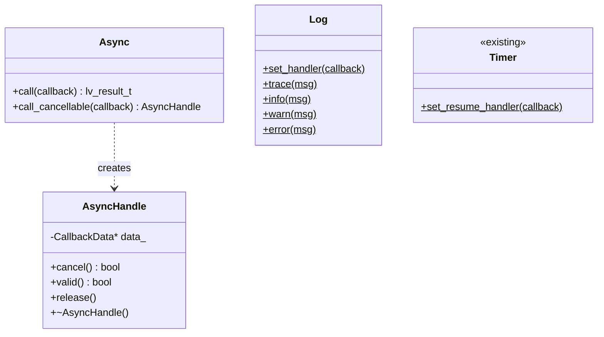

# Callback utilities: Standalone deferred and async patterns

## 1. Executive Summary

**Issue 98** requests a C++ wrapper for `lv_async_call`, but this is a **symptom of a broader design gap**: LVGL's miscellaneous utility callbacks lack idiomatic C++ wrappers. This document proposes a unified abstraction layer for "standalone callback utilities" that bridges the C void-pointer callback pattern to type-safe C++ functors.

> [!IMPORTANT]
> This design addresses multiple missing utility wrappers and establishes an extensible pattern for C-style callback utilities.

---

## 2. Comprehensive API Gap Analysis

The following table documents **all** LVGL callback-based utility functions and their current lvgl_cpp status:

| LVGL Function | Module | Purpose | lvgl_cpp Status | Proposed Action |
| :--- | :--- | :--- | :--- | :--- |
| `lv_async_call()` | misc/lv_async | Deferred execution | ❌ Not wrapped | **Add `Async` class** |
| `lv_async_call_cancel()` | misc/lv_async | Cancel pending async | ❌ Not wrapped | **Add `AsyncHandle`** |
| `lv_log_register_print_cb()` | misc/lv_log | Custom log handler | ❌ Not wrapped | **Add `Log` class** |
| `lv_timer_handler_set_resume_cb()` | misc/lv_timer | Timer resume callback | ❌ Not wrapped | **Add to existing `Timer`** |
| `lv_subject_add_observer()` | others/observer | Reactive bindings | ✅ `core/observer.h` | No action needed |
| `lv_subject_add_observer_obj()` | others/observer | Widget-scoped observer | ✅ `core/observer.h` | No action needed |
| `lv_profiler_*` | misc/lv_profiler | Performance profiling | N/A (macro-based) | Out of scope |
| `lv_sysmon_*` | others/sysmon | System monitor widgets | N/A (widget-based) | Out of scope |

> [!NOTE]
> **Implementation Discovery**: `lv_async_call` internally creates a **0ms one-shot timer** (see `lv_async.c`). The cancellation mechanism (`lv_async_call_cancel`) matches by both the C callback pointer AND user_data pointer. This has implications for C++ wrappers using `std::function` because we cannot easily match C-level function pointers with C++ closures.

---

## 3. Proposed Design

### 3.1. Design Principles

1. **Logical grouping**: Related functions grouped into utility classes (not free functions)
2. **Fire-and-forget safety**: For one-shot async calls, the wrapper manages callback lifetime automatically
3. **Cancellable handles**: For async calls that may need cancellation, return an RAII handle
4. **Consistency with Timer**: Follow the established `Timer::oneshot()` pattern for API familiarity
5. **Zero overhead**: Inline wrappers compile down to raw C calls when not using closures

### 3.2. Proposed Class Hierarchy



### 3.3. Proposed APIs

#### 3.3.1. Async Utilities (`misc/async.h`)

```cpp
namespace lvgl {

/**
 * @brief Handle for a cancellable async call.
 * 
 * When destroyed, cancels the pending async call if not yet executed.
 * Move-only type to prevent double-cancellation.
 */
class AsyncHandle {
 public:
  AsyncHandle();
  ~AsyncHandle();
  
  AsyncHandle(const AsyncHandle&) = delete;
  AsyncHandle& operator=(const AsyncHandle&) = delete;
  AsyncHandle(AsyncHandle&& other) noexcept;
  AsyncHandle& operator=(AsyncHandle&& other) noexcept;
  
  /**
   * @brief Cancel the pending async call.
   * @return true if cancelled, false if already executed or invalid.
   */
  bool cancel();
  
  /**
   * @brief Check if this handle is valid (has a pending call).
   */
  bool valid() const;
  
  /**
   * @brief Release ownership without cancelling.
   * The async call will still execute but cannot be cancelled.
   */
  void release();

 private:
  struct CallbackData;
  CallbackData* data_;
  
  friend class Async;
};

/**
 * @brief Utility class for deferred/asynchronous execution.
 * 
 * All methods are static since async calls are global operations.
 */
class Async {
 public:
  /**
   * @brief Schedule a callback for deferred execution (fire-and-forget).
   * 
   * The callback will execute on the next lv_timer_handler() cycle.
   * This is safe for thread-to-UI communication.
   * 
   * @param callback The function to execute asynchronously.
   * @return LV_RESULT_OK on success, LV_RESULT_INVALID on failure.
   * 
   * @example
   * lvgl::Async::call([this]() { this->update_ui(); });
   */
  static lv_result_t call(std::function<void()> callback);

  /**
   * @brief Schedule a cancellable callback for deferred execution.
   * 
   * Returns a handle that can be used to cancel the pending call.
   * If the handle is destroyed before execution, the call is cancelled.
   * 
   * @param callback The function to execute asynchronously.
   * @return An AsyncHandle for cancellation.
   * 
   * @example
   * auto handle = lvgl::Async::call_cancellable([this]() { this->do_work(); });
   * handle.cancel();  // Cancel if needed
   */
  static AsyncHandle call_cancellable(std::function<void()> callback);
};

}  // namespace lvgl
```

#### 3.3.2. Log Utilities (`misc/log.h`)

```cpp
namespace lvgl {

/**
 * @brief Scoped enum for log levels.
 */
enum class LogLevel : int8_t {
  Trace = LV_LOG_LEVEL_TRACE,
  Info = LV_LOG_LEVEL_INFO,
  Warn = LV_LOG_LEVEL_WARN,
  Error = LV_LOG_LEVEL_ERROR,
  User = LV_LOG_LEVEL_USER,
  None = LV_LOG_LEVEL_NONE
};

/**
 * @brief Utility class for LVGL logging configuration.
 * 
 * All methods are static since logging is a global operation.
 */
class Log {
 public:
  using Handler = std::function<void(LogLevel level, std::string_view message)>;
  
  /**
   * @brief Set a custom log handler.
   * 
   * @param handler The callback to receive log messages.
   *                Pass nullptr to clear the handler.
   * 
   * @example
   * lvgl::Log::set_handler([](lvgl::LogLevel level, std::string_view msg) {
   *     std::cerr << "[LVGL] " << msg << std::endl;
   * });
   */
  static void set_handler(Handler handler);
  
  /**
   * @brief Clear the custom log handler.
   */
  static void clear_handler();
  
  /**
   * @brief Log a message at the specified level.
   */
  static void log(LogLevel level, const char* format, ...);
  
  // Convenience methods
  static void trace(const char* format, ...);
  static void info(const char* format, ...);
  static void warn(const char* format, ...);
  static void error(const char* format, ...);

 private:
  static Handler handler_;
  static void log_proxy(lv_log_level_t level, const char* buf);
};

}  // namespace lvgl
```

#### 3.3.3. Timer Extension (modify existing `misc/timer.h`)

```cpp
// Add to existing Timer class:
class Timer {
 public:
  // ... existing methods ...
  
  /**
   * @brief Set a callback to be called when the timer system resumes.
   * 
   * This is called when lv_timer_enable(true) is called after the
   * timer system was disabled.
   * 
   * @param callback The resume callback.
   */
  static void set_resume_handler(std::function<void()> callback);
  
  /**
   * @brief Clear the resume handler.
   */
  static void clear_resume_handler();
  
 private:
  static std::function<void()> resume_handler_;
  static void resume_handler_proxy(void* user_data);
};
```

### 3.4. Implementation Strategy

#### Async Implementation Pattern

```cpp
// Internal callback data structure (in async.cpp)
struct AsyncHandle::CallbackData {
  std::function<void()> callback;
  std::atomic<bool> executed{false};
  std::atomic<bool> cancelled{false};
  lv_async_cb_t c_callback;  // Stored for cancellation matching
};

// C trampoline function
static void async_proxy(void* user_data) {
  auto* data = static_cast<AsyncHandle::CallbackData*>(user_data);
  if (!data->cancelled.load() && data->callback) {
    data->executed.store(true);
    data->callback();
  }
  // For fire-and-forget, delete data here
  // For cancellable, data is owned by AsyncHandle
}

lv_result_t Async::call(std::function<void()> callback) {
  auto* data = new CallbackData{std::move(callback)};
  auto result = lv_async_call(async_proxy, data);
  if (result != LV_RESULT_OK) {
    delete data;
  }
  return result;
}
```

---

## 4. Trade-off Analysis

| Aspect | Static Class Methods | Free Functions |
| :--- | :--- | :--- |
| **Discoverability** | ✅ `Async::call()` groups related ops | Less organized |
| **Extensibility** | ✅ Easy to add methods | Namespace pollution |
| **Consistency** | ✅ Matches existing Timer, Log patterns | Inconsistent |

### Alternative Considered: Free Functions

```cpp
// Rejected approach
namespace lvgl {
  lv_result_t async_call(std::function<void()> cb);
  AsyncHandle async_call_cancellable(std::function<void()> cb);
  void log_set_handler(...);
}
```

**Reason for rejection**: Free functions don't group logically related operations. Static class methods provide better organization and discoverability.

---

## 5. Implementation Plan

### Phase 1: Async Utilities

| Action | File | Description |
| :--- | :--- | :--- |
| **NEW** | `misc/async.h` | `Async` class and `AsyncHandle` |
| **NEW** | `misc/async.cpp` | Implementation with C trampoline |
| **MODIFY** | `lvgl_cpp.h` | Add `#include "misc/async.h"` |
| **MODIFY** | `CMakeLists.txt` | Add `misc/async.cpp` to sources |

### Phase 2: Log Utilities

| Action | File | Description |
| :--- | :--- | :--- |
| **NEW** | `misc/log.h` | `Log` class with `LogLevel` enum |
| **NEW** | `misc/log.cpp` | Implementation with handler storage |
| **MODIFY** | `lvgl_cpp.h` | Add `#include "misc/log.h"` |
| **MODIFY** | `CMakeLists.txt` | Add `misc/log.cpp` to sources |

### Phase 3: Timer Resume Handler

| Action | File | Description |
| :--- | :--- | :--- |
| **MODIFY** | `misc/timer.h` | Add `set_resume_handler()` static method |
| **MODIFY** | `misc/timer.cpp` | Implement resume handler with C trampoline |

---

## 6. Verification Plan

### 6.1. Automated Tests

#### New Test File: `tests/test_async.cpp`

```bash
# Build and run
cd /home/sunil/git/lvgl/lvgl_cpp/build
cmake .. && make -j$(nproc)
./test_async
```

| Test Case | Expected Behavior |
| :--- | :--- |
| `test_async_fire_and_forget` | Callback executes after `lv_timer_handler()` |
| `test_async_cancel_before_exec` | Callback does not execute |
| `test_async_cancel_after_exec` | `cancel()` returns false, no crash |
| `test_async_handle_move` | Moved handle still cancels correctly |
| `test_async_release_handle` | Callback executes, handle becomes invalid |

#### New Test File: `tests/test_log.cpp`

```bash
./test_log
```

| Test Case | Expected Behavior |
| :--- | :--- |
| `test_log_set_handler` | Custom handler receives log messages |
| `test_log_clear_handler` | No crash when handler is cleared |
| `test_log_level_filtering` | Messages respect log level |

### 6.2. Existing Test Integration

The existing test infrastructure uses a simple pattern. Each test is a standalone executable:

```bash
# Run all tests
cd /home/sunil/git/lvgl/lvgl_cpp/build
ctest --output-on-failure
```

---

## 7. References

- LVGL Async Header: `lvgl/src/misc/lv_async.h`
- LVGL Log Header: `lvgl/src/misc/lv_log.h`
- LVGL Timer Header: `lvgl/src/misc/lv_timer.h`
- Existing Timer Wrapper: `misc/timer.h`
- Existing Observer Wrapper: `core/observer.h`
- Issue: [Issue #98](https://github.com/pedapudi/lvgl_cpp/issues/98)
