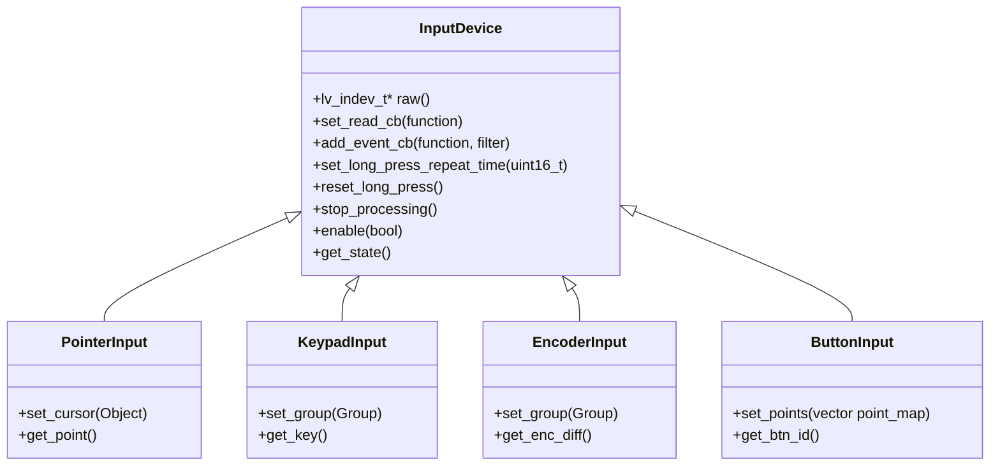

# design/input_devices.md

**Tracking Issue:** #66

## 1. Analysis of LVGL Input Device Architecture (v9)

LVGL 9.4 introduces a simplified yet powerful API for Input Devices (`lv_indev`), abstracting hardware inputs into four logical types. Unlike v8, where drivers were registered via structs, v9 uses a direct object-creation model.

### 1.1. The Four Input Types
1.  **Pointer (`LV_INDEV_TYPE_POINTER`)**
    *   **Hardware**: Touchpads, Mice, Touchscreens.
    *   **Data**: X/Y coordinates and Pressed/Released state.
    *   **Features**:
        *   **Cursor**: Can associate a visual `lv_obj` (usually an image) to follow coordinates.
        *   **Multi-touch**: Supported by creating *multiple* pointer instances (one per finger).
        *   **Gestures**: Built-in detection for Scroll, Swipe, and basic directions.
2.  **Keypad (`LV_INDEV_TYPE_KEYPAD`)**
    *   **Hardware**: Physical Keyboards, dense Button arrays.
    *   **Data**: Specific `uint32_t` key codes (ASCII or `LV_KEY_*` control keys) and state.
    *   **Dependency**: **Must** be assigned to an `lv_group_t` to function. It sends keys to the *focused* object in that group.
3.  **Encoder (`LV_INDEV_TYPE_ENCODER`)**
    *   **Hardware**: Rotary Encoder with Push button.
    *   **Data**: `enc_diff` (int16_t relative steps) and state.
    *   **Logic**:
        *   **Navigate Mode**: Turning moves focus between widgets in the assigned `Group`.
        *   **Edit Mode**: Clicking enters the widget (if editable); turning then changes the widget's value (e.g., Slider volume).
4.  **Button (`LV_INDEV_TYPE_BUTTON`)**
    *   **Hardware**: External physical buttons around a screen.
    *   **Data**: ID of the pressed button.
    *   **Logic**: Maps physical button IDs to on-screen coordinates, simulating a touch press at that location.

### 1.2. The integration workflow
The standard lifecycle in C involves:
1.  **Creation**: `lv_indev_t* indev = lv_indev_create()`.
2.  **Configuration**:
    *   `lv_indev_set_type(indev, LV_INDEV_TYPE_...)`
    *   `lv_indev_set_read_cb(indev, my_read_cb)`
    *   `lv_indev_set_user_data(indev, context)`
3.  **Execution**:
    *   **Polling**: Default. LVGL calls `read_cb` every 30ms (configurable).
    *   **Event-Driven**: Hardware ISR calls `lv_indev_read(indev)` to force an immediate read.

## 2. Implemented Architecture

### 2.1. Overview
The C++ wrapper strictly enforces type safety and RAII ownership. Unlike the raw C API where any `lv_indev_t*` can be cast to anything, the C++ classes ensure that methods like `set_group` are only available on devices that support them (Keypad, Encoder).

### 2.2. Class Hierarchy



### 2.3. Key Features

#### Type-Safe Group Assignment
Only `KeypadInput` and `EncoderInput` expose the `set_group()` method. This prevents runtime errors where a pointer device is accidentally assigned to a navigation group.

```cpp
auto enc = EncoderInput::create();
lvgl::Group group = lvgl::Group::get_default();
enc.set_group(group); // ✅ Valid
// pointer.set_group(group); // ❌ Compile-time error
```

#### Functional Callbacks
The wrapper handles the static C trampoline internally. You can pass a C++ lambda (even with captures) directly to `set_read_cb`.

```cpp
auto touch = PointerInput::create();
touch.set_read_cb([](IndevData& data) {
    if (MyHardware::is_pressed()) {
        data.set_state(IndevState::Pressed)
            .set_point(MyHardware::get_x(), MyHardware::get_y());
    } else {
        data.set_state(IndevState::Released);
    }
});
```

#### Event Handling
LVGL 9 introduces event callbacks for input devices. The C++ wrapper provides a consistent interface via `add_event_cb`.

```cpp
auto touch = PointerInput::create();
touch.add_event_cb([](lv_event_t* e) {
    if (lv_event_get_code(e) == LV_EVENT_CLICKED) {
        // Handle click event
    }
});
```

#### Enhanced Configuration
V9-specific configurations like long press repeat time and click streak tracking are exposed directly.

```cpp
touch.set_long_press_repeat_time(200);
uint8_t streak = touch.get_short_click_streak();
```

#### RAII Ownership
*   **Managed**: `Derived::create()` returns an object that owns the `lv_indev_t`. It deletes the driver when the C++ object goes out of scope.
*   **Unmanaged**: `Derived(lv_indev_t*)` wraps an existing driver (e.g., created by board init code) without taking ownership.

### 2.4. Python & Binding Support
The implementation uses `std::function` for callbacks, making it easy to bridge to Python or other languages via `pybind11` or `ctypes` by simply wrapping the callback mechanism.

