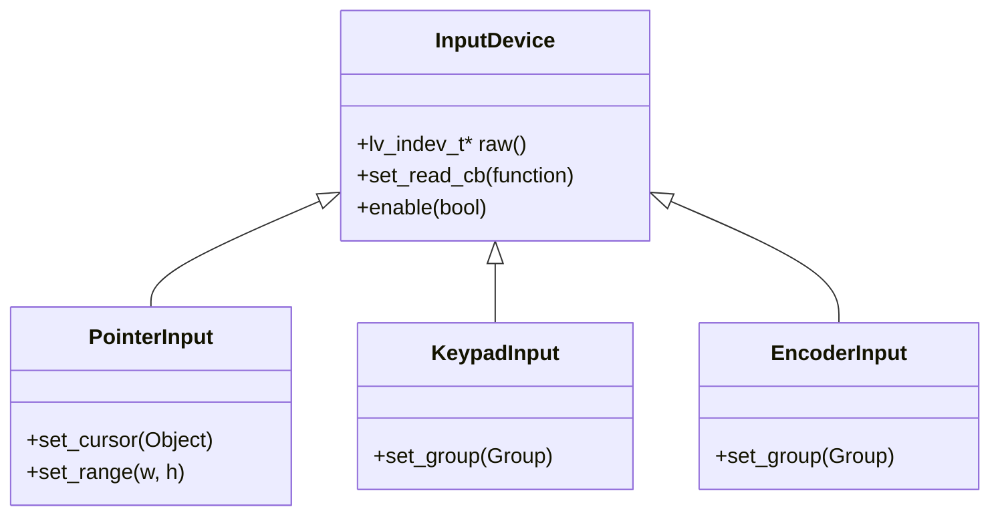

# design/input_devices.md

**Tracking Issue:** #66

## 1. Analysis of LVGL Input Device Architecture (v9)

LVGL 9.4 introduces a simplified yet powerful API for Input Devices (`lv_indev`), abstracting hardware inputs into four logical types. Unlike v8, where drivers were registered via structs, v9 uses a direct object-creation model.

### 1.1. The Four Input Types
1.  **Pointer (`LV_INDEV_TYPE_POINTER`)**
    *   **Hardware**: Touchpads, Mice, Touchscreens.
    *   **Data**: X/Y coordinates and Pressed/Released state.
    *   **Features**:
        *   **Cursor**: Can associate a visual `lv_obj` (usually an image) to follow coordinates.
        *   **Multi-touch**: Supported by creating *multiple* pointer instances (one per finger).
        *   **Gestures**: Built-in detection for Scroll, Swipe, and basic directions.
2.  **Keypad (`LV_INDEV_TYPE_KEYPAD`)**
    *   **Hardware**: Physical Keyboards, dense Button arrays.
    *   **Data**: Specific `uint32_t` key codes (ASCII or `LV_KEY_*` control keys) and state.
    *   **Dependency**: **Must** be assigned to an `lv_group_t` to function. It sends keys to the *focused* object in that group.
3.  **Encoder (`LV_INDEV_TYPE_ENCODER`)**
    *   **Hardware**: Rotary Encoder with Push button.
    *   **Data**: `enc_diff` (int16_t relative steps) and state.
    *   **Logic**:
        *   **Navigate Mode**: Turning moves focus between widgets in the assigned `Group`.
        *   **Edit Mode**: Clicking enters the widget (if editable); turning then changes the widget's value (e.g., Slider volume).
4.  **Button (`LV_INDEV_TYPE_BUTTON`)**
    *   **Hardware**: External physical buttons around a screen.
    *   **Data**: ID of the pressed button.
    *   **Logic**: Maps physical button IDs to on-screen coordinates, simulating a touch press at that location.

### 1.2. The integration workflow
The standard lifecycle in C involves:
1.  **Creation**: `lv_indev_t* indev = lv_indev_create()`.
2.  **Configuration**:
    *   `lv_indev_set_type(indev, LV_INDEV_TYPE_...)`
    *   `lv_indev_set_read_cb(indev, my_read_cb)`
    *   `lv_indev_set_user_data(indev, context)`
3.  **Execution**:
    *   **Polling**: Default. LVGL calls `read_cb` every 30ms (configurable).
    *   **Event-Driven**: Hardware ISR calls `lv_indev_read(indev)` to force an immediate read.

## 2. Current state of `lvgl_cpp` and gap analysis

### 2.1. Current implementation
*   **Wrappers**: `InputDevice` exists but is a *passive* wrapper around an existing `lv_indev_t*`.
*   **Gap 1: No Creation**: Users cannot create a new driver (e.g., "I have a button connected to GPIO 5") using C++. They must write C boilerplate.
*   **Gap 2: No Type Safety**: `lv_indev_t` is opaque. There is no distinction in the C++ type system between a Keypad (requires Group) and a Pointer (requires Cursor).
*   **Gap 3: Callback Hell**: Implementing `read_cb` requires a static C function. Accessing C++ instance data from there requires unsafe `void*` casting.

## 3. Proposed C++ Design

### 3.1. Goals
1.  **Idiomatic Creation**: `auto touch = PointerInput::create();`
2.  **Lambda Callbacks**: `touch.on_read([](auto& data){ ... });`
3.  **RAII Ownership**: The C++ object should manage the `lv_indev_delete()` lifecycle if it created the device.
4.  **Type Safety**: Distinct classes (`PointerInput`, `KeypadInput`) enforcing requirements like Groups.

### 3.2. Class hierarchy



### 3.3. Technical implementation details

#### The callback dispatcher
To support C++ lambdas, we use `lv_indev_set_user_data`.

```cpp
// Static trampoline
static void cpp_read_cb_trampoline(lv_indev_t* indev, lv_indev_data_t* data) {
    auto* instance = static_cast<InputDevice*>(lv_indev_get_user_data(indev));
    if (instance) {
        instance->process_read(data); // Calls the user's std::function
    }
}
```

#### Ownership strategy
We support two modes:
1.  **Managed (Owner)**: Created via `InputDevice::create()`. Destructor calls `lv_indev_delete()`.
2.  **Unmanaged (Observer)**: Wrapped via `InputDevice::wrap()`. Destructor does nothing.

### 3.4. Usage recipes

#### Recipe 1: Touchscreen driver (pointer)
```cpp
// Create a managed pointer device
auto touch = PointerInput::create();

// Define the hardware logic inline
touch.on_read([](InputData& data) {
    if (MyHardware::is_touched()) {
        auto [x, y] = MyHardware::get_coords();
        data.point = {x, y};
        data.state = LV_INDEV_STATE_PRESSED;
    } else {
        data.state = LV_INDEV_STATE_RELEASED;
    }
});

// Optional: Assign a customized cursor
Image cursor_img;
cursor_img.set_src("S:/mouse_icon.png");
touch.set_cursor(cursor_img);
```

#### Recipe 2: Encoder navigation
```cpp
// 1. Create the Group for navigation
Group menu_group;
menu_group.add(btn_ok);
menu_group.add(slider_volume);
menu_group.set_default();

// 2. Create the Encoder Driver
auto enc = EncoderInput::create();
enc.set_group(menu_group); // Critical step enforced by API

// 3. Hardware Logic
enc.on_read([](InputData& data) {
    data.enc_diff = MyHardware::get_encoder_delta(); // e.g., +1 or -1
    data.state = MyHardware::is_btn_pressed() ? LV_INDEV_STATE_PRESSED : LV_INDEV_STATE_RELEASED;
});
```

#### Recipe 3: Keyboard (desktop/SDL style)
```cpp
auto kb = KeypadInput::create();
kb.set_group(active_group);
kb.on_read([](InputData& data) {
    if (SDL_HasKey()) {
        data.key = SDL_GetKey(); // Maps to LV_KEY_*
        data.state = LV_INDEV_STATE_PRESSED;
    }
});
```

## 4. Implementation Plan
1.  **Core Class w/ Trampoline**: Implement `InputDevice` with `user_data` logic.
2.  **Subclasses**: Implement `PointerInput`, `KeypadInput`, etc., exposing only relevant methods.
3.  **Group Integration**: Ensure `Group` class (in `core/group.h`) is robust enough to be passed to these devices.
